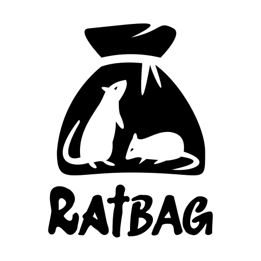
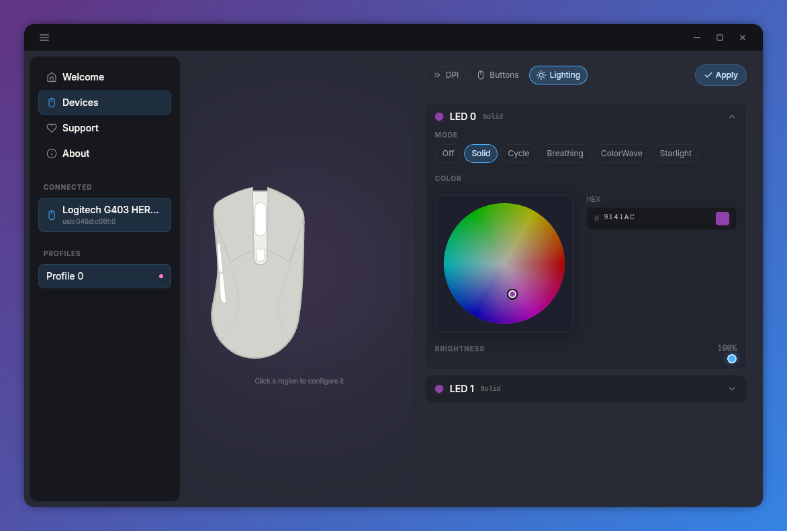
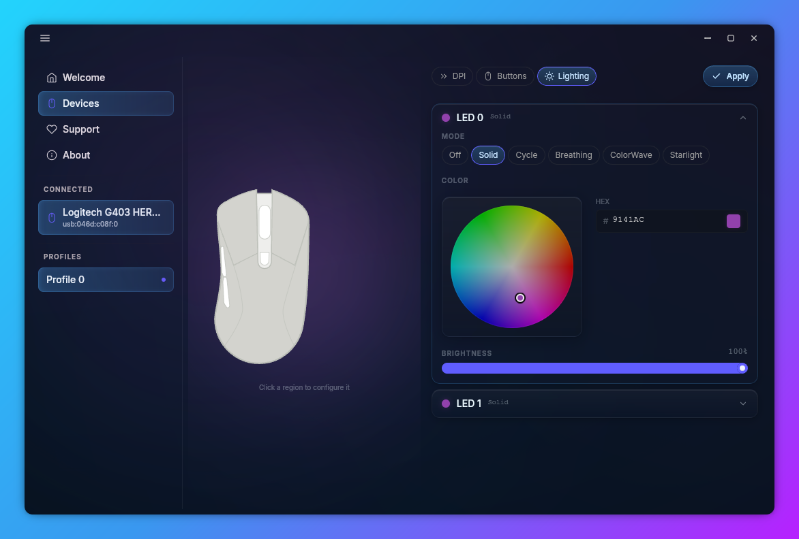

<p align="center">
  
</p>

<h1 align="center">Twister</h1>

<p align="center">
  <strong>A modern, desktop-agnostic graphical interface for configuring gaming mice on Linux.</strong>
</p>

<p align="center">
  <a href="https://github.com/niltonperimneto/libratbag-rs">
    
  </a>
  
</p>

<p align="center">
  
</p>

Twister is the official companion frontend for **[ratbagd-rs](https://github.com/niltonperimneto/libratbag-rs)**, a ground-up memory-safe Rust rewrite of the `ratbagd` system daemon. It communicates seamlessly via the `org.freedesktop.ratbag1` D-Bus interface to bring you total control over your gaming peripherals.

> **Status:** Active development — early alpha. Core features work beautifully. Packaging automation is underway. Contributions are warmly welcomed!

---

## Why Twister?

The existing configuration tool for libratbag on Linux is
[Piper](https://github.com/libratbag/piper), which is a GTK 3 application written in Python.
Piper is functional but carries limitations that motivated this project:

| Concern | Piper | Twister |
|---|---|---|
| **Toolkit** | GTK 3 | Tauri 2 |
| **Language** | Python 3 | Rust + TypeScript (Svelte 5) |
| **DE dependency** | GNOME preferred | Desktop-agnostic |

Twister works on any Linux desktop — GNOME, KDE Plasma, Sway, Hyprland, i3, or a bare window
manager — with no compositor plugins, Shell extensions, or GTK theme configuration required.

---

## Features

- **DPI management** — Add, remove, and reorder resolution stages per profile. Set X/Y DPI
  independently. Toggle the active resolution stage.
- **Button remapping** — Map mouse buttons to mouse actions, keys, or special protocol actions.
- **LED lighting** — Control LED mode (off, solid, breathing, cycling, wave, reactive), RGB colour
  via an interactive colour wheel, brightness, and effect duration.
- **Per-profile configuration** — Switch between hardware profiles. Each profile has its own DPI
  ladder, button map, polling rate, and LED state.
- **Hardware commit** — Changes are staged locally and written to hardware on demand (`Apply` button
  or `Ctrl+S`).
- **Device visualiser** — Interactive SVG map of the mouse. Button and LED regions are revealed on
  hover with a glow effect. Clicking a region jumps to the relevant editor tab.
- **Glassmorphic UI** — Floating panels, rounded corners, Inter typeface, micro-interactions, and
  dark-mode-first design.
- **CSD titlebar** — Custom client-side decorations with minimize, maximize, and close controls.
  Window corners round/square automatically on maximize/restore.
- **Keyboard shortcuts** — `Ctrl+S` commit, `Ctrl+B` toggle sidebar, `Ctrl+Tab`/`Shift+Ctrl+Tab`
  cycle editor tabs, `Ctrl+Q` quit.

---

## Screenshots

| Overview & DPI | Welcome Screen |
| :---: | :---: |
|  |  |
| **Support us** | **Lighting & RGB** |
|  |  |

---

## Requirements

### Runtime

| Component | Minimum version | Notes |
|---|---|---|
| Linux kernel | 5.10+ | Recommended: 6.x |
| ratbagd **or** ratbagd-rs | Any | Must be running and accessible on D-Bus |
| WebKitGTK | 4.1 or 6.0 | Provided by your distro |
| glib2 | 2.74+ | Provided by your distro |

### Build-time (development only)

| Tool | Version |
|---|---|
| Rust toolchain | 1.85+ (edition 2024) |
| Node.js | 20+ |
| npm | 10+ |
| Tauri CLI | 2.x (`cargo install tauri-cli`) |

---

## Installation

### From source

```bash
# 1. Clone the repository (Twister lives inside the libratbag-rs repo)
git clone https://github.com/niltonperimneto/twister.git
cd twister

# 2. Install JavaScript dependencies
npm install

# 3. Build and run
cargo tauri dev          # development hot-reload
cargo tauri build        # production bundle
```

> **Note:** The `ratbagd` or `ratbagd-rs` daemon must be running before starting Twister.
> See the [ratbagd-rs repository](https://github.com/niltonperimneto/libratbag-rs) for setup instructions.

### Build & install with Meson (app + daemons in one shot)

The Meson superproject builds and installs Twister **together with both daemons it
talks to** — [clackd](https://github.com/niltonperimneto/clackd) (keyboards) and
[libratbag-rs / ratbagd](https://github.com/niltonperimneto/libratbag-rs) (mice) —
pulled in as Meson subprojects. One install lays down the GUI, both daemon binaries,
their D-Bus service files, systemd user units, udev rules, and ratbagd's device
database.

```bash
# Easiest: the convenience installer (configures, builds, installs).
./install.sh                       # prefix=/usr, both daemons bundled

# Or drive Meson directly. NOTE: the build dir is `builddir`, not `build`
# (`build/` is the vite frontend output and would be clobbered).
meson setup builddir --prefix=/usr --buildtype=release
meson compile -C builddir
sudo meson install -C builddir
```

Pick and choose which daemons to bundle with the feature options (default: both):

```bash
meson setup builddir -Dclackd=disabled    # app + ratbagd only (no keyboard daemon)
meson setup builddir -Dratbagd=disabled   # app + clackd only  (no mouse daemon)
```

After installing, finish in your **normal user session** (not under `sudo`):

```bash
systemctl --user daemon-reload
systemctl --user enable --now clackd.service ratbagd.service
```

`clackd` needs one udev line per VIA keyboard you want managed (the Epomaker EK68 /
Zuoya GMK67 line ships preinstalled). Edit `/etc/udev/rules.d/60-clackd-via.rules`,
then `sudo udevadm control --reload-rules && sudo udevadm trigger`.

> For local development you can build the daemons from sibling checkouts instead of
> cloning: symlink them into `subprojects/` —
> `ln -s ../../clackd subprojects/clackd` and
> `ln -s ../../libratbag-rs subprojects/libratbag`.

### Starting the daemon (ratbagd-rs)

```bash
# Using systemd
sudo systemctl start ratbagd

# Or manually
sudo ratbagd
```

---

## Usage

1. Connect your gaming mouse.
2. Ensure `ratbagd` (or `ratbagd-rs`) is running.
3. Launch Twister. It will automatically connect and display your device.
4. Open the sidebar (`☰` or `Ctrl+B`) to select your device and profile.
5. Use the **DPI**, **Buttons**, and **Lighting** editor tabs to configure the device.
6. Click **Apply** (or press `Ctrl+S`) to write changes to hardware.

### Keyboard shortcuts

| Shortcut | Action |
|---|---|
| `Ctrl+S` | Commit pending changes to hardware |
| `Ctrl+B` | Toggle sidebar |
| `Ctrl+Tab` | Next editor tab |
| `Shift+Ctrl+Tab` | Previous editor tab |
| `Ctrl+Q` | Quit Twister |

---

## Architecture

```
twister/
├── src/                          # Svelte 5 frontend (TypeScript)
│   ├── App.svelte                # Root shell: layout, keyboard shortcuts, tab routing
│   ├── app.css                   # Global CSS (Tailwind v4, DaisyUI v5, custom tokens)
│   ├── lib/
│   │   ├── components/           # UI components
│   │   │   ├── Titlebar.svelte   # CSD titlebar with window controls
│   │   │   ├── Sidebar.svelte    # Navigation, device list, profile tabs
│   │   │   ├── DeviceVisualizer.svelte  # SVG mouse map with hover glow
│   │   │   ├── DpiEditor.svelte  # DPI resolution stage editor
│   │   │   ├── ButtonMapper.svelte      # Button remapping editor
│   │   │   ├── LedEditor.svelte  # LED lighting editor with colour wheel
│   │   │   ├── StatusOverlay.svelte     # Daemon connection error overlay
│   │   │   ├── WelcomePage.svelte
│   │   │   ├── AboutPage.svelte
│   │   │   └── DonatePage.svelte
│   │   ├── stores/               # Svelte 5 rune-based reactive stores
│   │   │   ├── device.svelte.ts  # Device tree, profile, mutation state
│   │   │   ├── theme.svelte.ts   # Surface mode detection (glass / opaque)
│   │   │   └── toast.svelte.ts   # In-app notification queue
│   │   ├── ipc/
│   │   │   └── commands.ts       # Typed wrapper for Tauri IPC commands
│   │   └── types.ts              # Shared TypeScript types / DTOs
├── src-tauri/                    # Tauri 2 Rust backend
│   ├── src/
│   │   ├── commands.rs           # Tauri IPC command handlers
│   │   ├── dbus_client.rs        # zbus D-Bus client (ratbagd protocol)
│   │   ├── dto.rs                # Serde serializable data transfer objects
│   │   ├── lib.rs                # Tauri app builder, state registration
│   │   └── main.rs               # Entry point
│   ├── Cargo.toml
│   └── tauri.conf.json           # Window config, CSP, bundle settings
└── scripts/                      # Build & packaging helpers
```

### D-Bus flow

```
Twister (Svelte UI)
   │  Tauri IPC (invoke / emit)
   ▼
Tauri Rust backend (commands.rs)
   │  zbus async D-Bus calls
   ▼
ratbagd / ratbagd-rs
   │  kernel HID subsystem
   ▼
Mouse hardware
```

Real-time hardware events (profile switch, DPI change via hardware button) are forwarded
to the UI via a background `watch_dbus_signals` task that listens for `PropertiesChanged`
signals on the `org.freedesktop.ratbag1` bus and emits a `ratbag:resync` Tauri event.

---

## Supported Devices

Twister supports any device that is supported by `libratbag` / `ratbagd-rs`. This includes
mice from Logitech, ASUS ROG, SteelSeries, Roccat, Glorious, Sinowealth, and others.

Device visualisations are rendered parametrically from the device's reported
capabilities (buttons, LEDs, resolutions), so every supported mouse gets an
interactive, annotated visual — no per-model artwork required. Buttons follow
the libratbag convention (0 left, 1 right, 2 wheel, 3 back, 4 forward, 5 DPI);
zones the silhouette can't seat are shown as selectable chips below it.

---

## Development

```bash
# Hot-reload development build (opens the Tauri window)
npm run dev               # starts Vite dev server + Tauri shell

# Type-check the frontend
npm run check

# Production build
cargo tauri build
```

### Code conventions

- All Rust code is `unsafe`-free (`unsafe_code = "forbid"` in `Cargo.toml`).
- Rust error handling uses `Result<T, E>` throughout. `unwrap()`, `expect()`, and `panic!()`
  are avoided.
- Shared state in the Rust backend uses `Arc<RwLock<T>>`.
- Svelte 5 runes (`$state`, `$effect`, `$props`) are used throughout the frontend.
- CSS design tokens are defined in `:root` in `app.css` and consumed via `var()`.

---

## Contributing

Contributions are very welcome! Please:

1. Fork the repository.
2. Create a feature branch: `git checkout -b my-feature`.
3. Commit using the Linux kernel commit style (short subject + blank line + body + `Signed-off-by:`).
4. Open a pull request.

For large changes, please open an issue first to discuss the approach.

---

## Related Projects

| Project | Description |
|---|---|
| [libratbag](https://github.com/libratbag/libratbag) | Upstream C library and ratbagd daemon |
| [ratbagd-rs](https://github.com/niltonperimneto/libratbag-rs) | Rust rewrite of ratbagd (Twister's backend) |
| [Piper](https://github.com/libratbag/piper) | GTK frontend for libratbag (original project) |

---

## License

Twister is free software: you can redistribute it and/or modify it under the terms of the
[GNU General Public License v3.0 or later](https://www.gnu.org/licenses/gpl-3.0.html).

```
Copyright (C) 2025-2026 Nilton Perim Neto <niltonperimneto@gmail.com>

This program is free software: you can redistribute it and/or modify
it under the terms of the GNU General Public License as published by
the Free Software Foundation, either version 3 of the License, or
(at your option) any later version.
```
